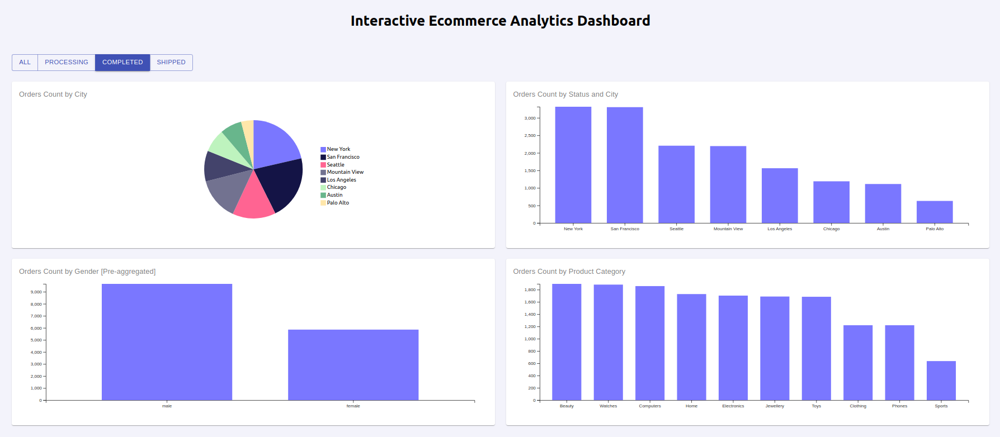

<h1 align="center" style="color: blue; font-family: Arial, sans-serif;">
  Interactive Ecommerce Analytics Dashboard
</h1>

Interactive analytics dashboard to visualize key ecommerce metrics and trends, enabling efficient data exploration and communication of insights. Using Cube.js to simplify complex data querying, aggregation, and visualization, streamlining the analytics workflow.

## Features

- **Orders Count by City:** Visualize the distribution of orders across different cities.
- **Orders Count by Status and City:** Analyze orders based on their status and city.
- **Orders Count by Product Category:** Explore the number of orders per product category.
- **Orders Count by Gender:** Examine the pre-aggregated data of orders by gender.

   
The **Orders Count by Gender** chart leverages the power of Cube.js pre-aggregations to optimize query performance and enhance the user experience. By pre-aggregating data, our system can quickly retrieve summarized results rather than computing them on-the-fly, significantly reducing query time and computational load. This approach ensures that the dashboard remains highly responsive, providing near-instant insights even with complex queries.

In our configuration, we define a pre-aggregation that includes the total order count, segmented by user city and gender, and updated every hour. This setup allows us to efficiently analyze order distributions across different demographic segments. For example, the provided chart shows the distribution of orders by gender, filtered to display data specifically for New York. This targeted analysis helps in understanding customer demographics and tailoring marketing strategies accordingly.

By utilizing pre-aggregations, we ensure that our dashboard delivers fast and accurate insights, empowering users to make data-driven decisions efficiently.

## Technology Stack

- **Backend:** [Cube.js](https://cube.dev/)
- **Frontend:** [React](https://reactjs.org/)
- **Database:** PostgreSQL
